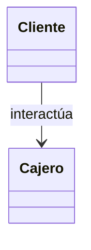
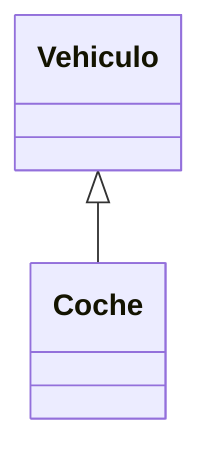
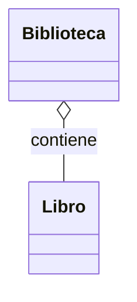
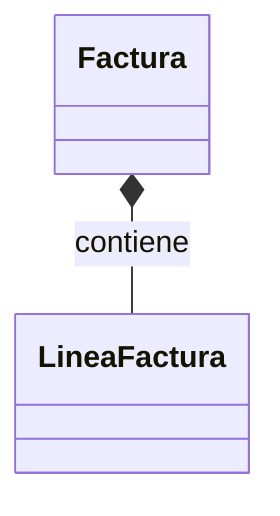

# Pilares Fundamentales

### Encapsulamiento
- Consiste en agrupar datos (atributos) y comportamientos (métodos) dentro de una misma entidad llamada **clase**.
- Permite controlar el acceso a la información mediante modificadores (público, privado, protegido), protegiendo el estado interno del objeto.
- Facilita el mantenimiento y la reutilización, ya que los detalles internos pueden cambiar sin afectar a quienes usan la clase.

### Abstracción
- Es el proceso de identificar los elementos esenciales de un sistema y modelarlos, dejando fuera los detalles irrelevantes.
- En POO se realiza mediante la definición de **clases** e **interfaces** que representan conceptos del dominio real.
- Permite enfocarse en qué hace un objeto (su comportamiento) en lugar de cómo lo hace internamente.

### Herencia
- Es la capacidad de una clase (subclase) de obtener las propiedades y métodos de otra clase (superclase).
- Facilita la reutilización de código y la organización jerárquica de conceptos similares.
- Una subclase puede extender (añadir) o especializar (modificar) el comportamiento heredado.

### Polimorfismo
- Permite que objetos de diferentes clases sean tratados de manera uniforme si comparten una misma interfaz o heredan de una misma clase base.
- Se manifiesta como:
  - **Sobrecarga** (mismo método con diferentes parámetros) — más común en algunos lenguajes.
  - **Sobrescritura** (override) — una subclase redefine el comportamiento de un método heredado.
- Facilita escribir código genérico que funcione con múltiples tipos relacionados.

---
# El Tejido del Sistema: Relaciones UML

## Asociación

---

## Herencia (Generalización)

---

## Agregación

---

## Composición

---

Nota rápida:

* `-->` → Asociación
* `<|--` → Herencia
* `o--` → Agregación (rombo vacío)
* `*--` → Composición (rombo lleno)

---