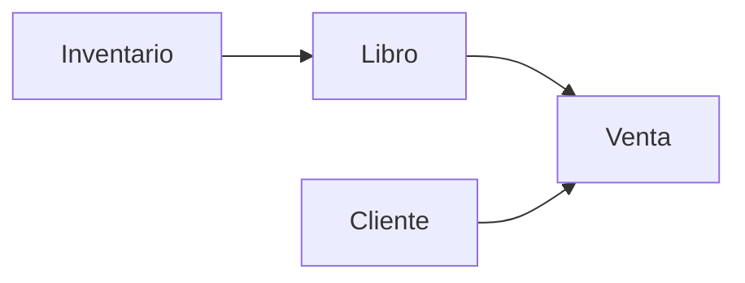
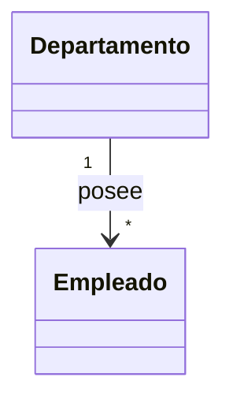
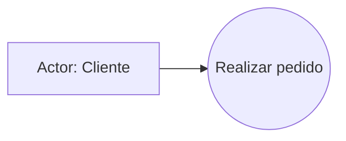
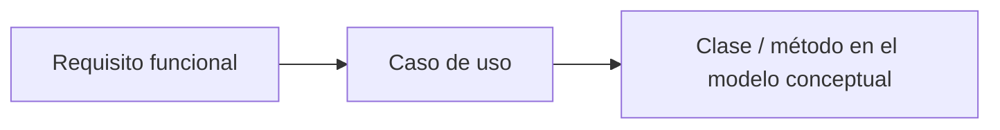

# Documentación estructurada en Markdown
## Dominio del problema y Diagramas de Casos de Uso

> **Asignatura:** Análisis y Diseño de Sistemas Orientado a Objetos  
> **Unidad II:** Análisis Orientado a Objetos  
> **Tema:** Dominio del Problema

---

## Índice

1. [Introducción](#introducción)
2. [Dominio del problema](#dominio-del-problema)
3. [Identificación de conceptos del dominio](#identificación-de-conceptos-del-dominio)
4. [Modelo conceptual](#modelo-conceptual)
5. [Relaciones entre clases](#relaciones-entre-clases)
6. [Multiplicidades](#multiplicidades)
7. [Restricciones](#restricciones)
8. [Vista de escenarios](#vista-de-escenarios)
9. [Diagrama de Casos de Uso UML](#diagrama-de-casos-de-uso-uml)
10. [Elementos UML presentados](#elementos-uml-presentados)
11. [Tipos de relaciones UML](#tipos-de-relaciones-uml)
12. [Relación entre requisitos y modelo del sistema](#relación-entre-requisitos-y-modelo-del-sistema)
13. [Buenas prácticas en Enterprise Architect](#buenas-prácticas-en-enterprise-architect)
14. [Glosario básico](#glosario-básico)
15. [Preguntas guía para repaso](#preguntas-guía-para-repaso)

---

## Introducción

Esta unidad se enfoca en comprender **el mundo real que el sistema debe representar** antes de diseñarlo formalmente. Para ello, se estudian dos ejes principales:

- **El dominio del problema**, que ayuda a identificar conceptos, reglas y relaciones del sistema.
- **Los diagramas de casos de uso**, que permiten representar cómo interactúan los actores con las funcionalidades del sistema.

La idea central es que un buen análisis orientado a objetos comienza con una comprensión clara del problema, de sus entidades y de sus interacciones. 

---

## Dominio del problema

### Definición

El **dominio del problema** es el conjunto de **conceptos, reglas y entidades del mundo real** que el sistema debe representar. 

### Importancia

Comprender el dominio del problema permite:

- entender con precisión qué problema se quiere resolver;
- evitar ambigüedades durante el análisis y diseño;
- identificar correctamente qué elementos del mundo real deben modelarse.

### Ejemplos de dominios

- Sistema de librería
- Sistema bancario
- Sistema de inventario

### Idea clave

Antes de programar, se debe responder una pregunta esencial:

> **¿Qué elementos del mundo real son indispensables para representar correctamente el sistema?**

---

## Identificación de conceptos del dominio

La presentación propone identificar conceptos observando la descripción del problema y distinguiendo entre **sustantivos** y **verbos**. 

### Método básico

| Paso | Acción | Resultado esperado |
|---|---|---|
| 1 | Buscar sustantivos | Posibles entidades o clases |
| 2 | Buscar verbos | Posibles operaciones o métodos |
| 3 | Separar entidades y acciones | Mejor organización del dominio |
| 4 | Refinar conceptos | Distinguir clases, atributos y métodos |

### Ejemplo: sistema de librería

**Entidades:**
- Libro
- Cliente
- Venta
- Inventario

**Acciones:**
- Registrar venta
- Consultar stock
- Actualizar inventario

### Interpretación orientada a objetos

| Elemento detectado | Puede convertirse en |
|---|---|
| Libro | Clase |
| Cliente | Clase |
| Venta | Clase |
| Título del libro | Atributo |
| Stock disponible | Atributo |
| Registrar venta | Método / caso de uso |
| Consultar stock | Método / caso de uso |

---

## Modelo conceptual

### Definición

El **modelo conceptual** es una representación gráfica de los conceptos del dominio y de las relaciones existentes entre ellos. 

### Qué contiene

- Clases y atributos principales
- Relaciones entre clases
- Restricciones
- Multiplicidades

### Esquema simplificado

### Lectura del ejemplo

- Un **cliente** participa en una **venta**.
- Un **libro** forma parte de una **venta**.
- El **inventario** contiene **libros**.

### Finalidad

El modelo conceptual ayuda a responder:

> **¿Qué relaciones representan mejor la realidad del dominio?**

---

## Relaciones entre clases

Las relaciones entre clases explican cómo se conectan los objetos dentro del modelo. La presentación destaca tres relaciones fundamentales: **asociación**, **composición** y **herencia**. 

### Tabla comparativa

| Relación | Significado | Característica principal | Ejemplo |
|---|---|---|---|
| Asociación | Una clase se relaciona con otra | Existe vínculo, pero cada una puede existir por separado | Cliente ↔ Pedido |
| Composición | Una clase contiene fuertemente a otra | Si el contenedor desaparece, el contenido también | Libro ↔ Páginas |
| Herencia | Una clase deriva de otra | Reutiliza estructura y comportamiento | Vehículo → Automóvil |

### Interpretación rápida

- **Asociación**: relación de uso o conocimiento.
- **Composición**: relación de pertenencia fuerte.
- **Herencia**: relación jerárquica del tipo “es un”.

---

## Multiplicidades

Las **multiplicidades** indican cuántas instancias de una clase pueden relacionarse con otra. 

### Notaciones comunes

| Notación | Significado |
|---|---|
| `1` | Exactamente uno |
| `0..*` o `*` | Cero a muchos |
| `1..*` | Uno a muchos, con al menos uno obligatorio |

### Ejemplo

> Un **Departamento [1]** posee muchos **Empleados [*]**. 

### Visualización rápida

---

## Restricciones

Las **restricciones** son reglas de negocio o límites que el sistema debe cumplir obligatoriamente. Se representan entre llaves `{ }`. 

### Tipos de restricciones

| Tipo | Ejemplo | Significado |
|---|---|---|
| Sobre atributos | `{edad >= 18}` | El valor del atributo debe cumplir una condición |
| Sobre relaciones | `{ordenado por fecha}` | La relación debe mantener un criterio determinado |
| Sobre jerarquías | `{disjoint, complete}` | Reglas aplicadas a clases de una generalización |

### Importancia

Las restricciones permiten que el modelo no solo represente objetos, sino también las **reglas reales del negocio**.

---

## Vista de escenarios

Los **escenarios** describen situaciones concretas en las que el sistema interactúa con actores externos. Su función principal es validar que el sistema cubre los requisitos funcionales. 

### Ejemplos sugeridos por la presentación

Para un sistema de librería, algunos escenarios críticos serían:

- venta;
- devolución;
- control de stock mínimo.

### Utilidad

Los escenarios ayudan a visualizar:

- qué hace el usuario;
- qué responde el sistema;
- qué casos son normales y cuáles son alternativos.

---

## Diagrama de Casos de Uso UML

El **diagrama de casos de uso** representa los actores externos y sus interacciones con el sistema. 

### Elementos básicos

| Elemento | Descripción |
|---|---|
| Actor | Usuario o sistema externo que interactúa con el sistema |
| Caso de uso | Funcionalidad o servicio que ofrece el sistema |
| Relaciones | Vínculos entre actores y casos de uso, o entre casos de uso |

### Relaciones mencionadas

- Asociación
- Generalización
- Inclusión
- Extensión

### Recomendación importante

Cada caso de uso debe documentarse con:

- su propósito;
- su escenario principal.

### Ejemplo mínimo

---

## Elementos UML presentados

La presentación organiza algunos elementos UML en categorías: estructurales, de comportamiento, de agrupación y de anotación. 

### 1. Elementos estructurales

#### Caso de uso

Es un conjunto de secuencias de acciones cuyo resultado es de interés para un actor particular. 

#### Actores

Son entidades externas que interactúan con el sistema. Representan todo aquello que necesita intercambiar información con él. 

**Tipos de actores:**

| Tipo | Función | Ejemplo |
|---|---|---|
| Primario | Inicia el escenario | Cliente |
| Secundario | Brinda soporte | Cajero, sistema de pagos |

### 2. Elementos de comportamiento

Representan la parte dinámica del sistema en el tiempo y el espacio. La presentación destaca la **interacción** como el conjunto de mensajes intercambiados entre objetos. 

### 3. Elementos de agrupación

Son elementos organizativos. El ejemplo principal es el **paquete**, entendido como un mecanismo general para organizar elementos. 

### 4. Elementos de anotación

Son partes explicativas que sirven para describir, clasificar y hacer observaciones. La **nota** permite añadir comentarios a uno o varios elementos del modelo. 

---

## Tipos de relaciones UML

Además de las relaciones del modelo conceptual, la presentación enumera relaciones UML adicionales. 

### Tabla resumen

| Relación | Descripción |
|---|---|
| Dependencia | Un elemento depende de otro y puede verse afectado semánticamente |
| Asociación | Conexión entre objetos, incluyendo rol, multiplicidad y calificador |
| Generalización | El hijo comparte estructura y comportamiento del padre |
| Realización | Relación semántica entre clasificadores |
| Composición | Una clase está contenida físicamente en otra |
| Agregación | Contención referencial; más débil que la composición |

### Diferencia clave entre agregación y composición

- **Composición**: la parte depende fuertemente del todo.
- **Agregación**: la parte puede seguir existiendo independientemente del todo.

---

## Relación entre requisitos y modelo del sistema

La presentación destaca una idea central de trazabilidad: **cada requisito funcional debe reflejarse en un caso de uso** y, a su vez, en elementos del modelo conceptual. 

### Cadena de trazabilidad

### Importancia de la rastreabilidad

La rastreabilidad permite:

- comprobar que todos los requisitos fueron implementados;
- detectar impactos cuando un requisito cambia;
- revisar coherencia entre análisis y diseño.

### Ejemplo sugerido

Si el requisito es **“Registrar venta”**, podrían intervenir clases como:

- `Venta`
- `Cliente`
- `Libro`
- `Inventario`

Y podrían aparecer relaciones como:

- asociación entre `Cliente` y `Venta`;
- asociación entre `Venta` y `Libro`;
- relación entre `Inventario` y `Libro`.

---

## Buenas prácticas en Enterprise Architect

La presentación sugiere varias buenas prácticas para modelar con mayor claridad. 

### Recomendaciones

| Práctica | Finalidad |
|---|---|
| Nombrar casos de uso claramente | Facilita la comprensión del sistema |
| Mantener actores consistentes | Evita duplicidades o contradicciones |
| Agrupar por subsistemas | Mejora la organización en sistemas grandes |
| Documentar escenarios y flujos | Aporta contexto y detalle funcional |
| Usar colores y notas | Resalta información crítica |

---

## Glosario básico

> Este glosario se organiza a partir de los conceptos desarrollados en las diapositivas. 

| Término | Definición breve |
|---|---|
| Dominio del problema | Conjunto de conceptos, reglas y entidades del mundo real que el sistema debe representar |
| Entidad | Objeto o concepto relevante dentro del sistema |
| Acción | Operación o comportamiento que el sistema puede ejecutar |
| Modelo conceptual | Representación gráfica de conceptos y relaciones |
| Caso de uso | Funcionalidad del sistema con valor para un actor |
| Actor | Entidad externa que interactúa con el sistema |
| Multiplicidad | Cantidad de instancias que pueden relacionarse |
| Restricción | Regla obligatoria del negocio o del modelo |
| Asociación | Relación general entre objetos |
| Composición | Relación de pertenencia fuerte |
| Herencia / generalización | Relación jerárquica entre clases |
| Paquete | Mecanismo para organizar elementos del modelo |
| Nota | Comentario explicativo dentro del diagrama |

---

## Preguntas guía para repaso

Estas preguntas retoman el enfoque reflexivo de la presentación. 

1. ¿Qué elementos del mundo real son esenciales en el sistema que se desea modelar?
2. ¿Qué conceptos deben convertirse en clases y cuáles en atributos o métodos?
3. ¿Qué relaciones representan mejor la realidad del dominio?
4. ¿Qué escenarios son críticos para validar los requisitos funcionales?
5. ¿Qué actores externos influyen en la operación del sistema?
6. ¿Qué flujos alternativos podrían afectar la experiencia del usuario?
7. ¿Todos los requisitos funcionales están cubiertos por casos de uso?
8. Si un requisito cambia, ¿qué diagramas y etapas deben revisarse para mantener consistencia?

---

## Síntesis final

En conjunto, la presentación muestra que el análisis orientado a objetos no se limita a dibujar diagramas, sino que comienza con la comprensión del dominio, continúa con la identificación de conceptos y relaciones, y se fortalece mediante escenarios, casos de uso y trazabilidad entre requisitos y modelo del sistema. Esa secuencia permite construir sistemas más claros, coherentes y alineados con la realidad que deben representar. 