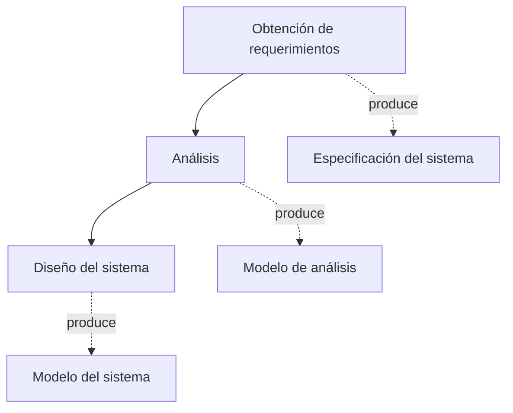
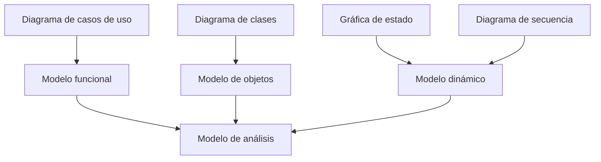
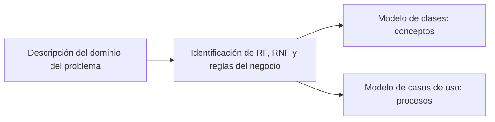

# Documentación estructurada: Dominio del Problema

> **Asignatura:** Análisis y Diseño de Sistemas Orientado a Objetos  
> **Unidad II:** Análisis Orientado a Objetos  
> **Tema:** Dominio del Problema

---

## 1. Introducción

El **análisis orientado a objetos** se centra en construir un **modelo del sistema** llamado **modelo de análisis**. Este modelo debe ser:

- **Correcto**
- **Completo**
- **Consistente**
- **Verificable**

La idea principal es que el análisis **no se limita a recopilar requerimientos**, sino que busca **estructurarlos, organizarlos y formalizarlos** para que puedan convertirse en una base sólida para el diseño del sistema.

> En otras palabras, primero se comprende el problema y luego se representa de forma ordenada para preparar el desarrollo del software.

---

## 2. Análisis orientado a objetos

## 2.1 ¿Qué hace el análisis?

El análisis toma la información obtenida de los usuarios y del contexto real, y la transforma en una representación más precisa del sistema que se quiere construir.

### Diferencia entre obtención de requerimientos y análisis

| Etapa | Enfoque principal | Resultado |
|---|---|---|
| **Obtención de requerimientos** | Recoger necesidades, problemas y expectativas de los usuarios | Información inicial del sistema |
| **Análisis** | Estructurar y formalizar esa información | Modelo de análisis |
| **Diseño del sistema** | Definir cómo se implementará técnicamente la solución | Modelo del sistema |

### Flujo general del proceso

---

## 3. Modelo de análisis

El **modelo de análisis** está compuesto por **tres modelos individuales** que permiten estudiar el sistema desde distintos puntos de vista.

### 3.1 Componentes del modelo de análisis

| Modelo | Representación principal | Qué describe |
|---|---|---|
| **Modelo funcional** | Casos de uso y escenarios | Lo que el sistema debe hacer |
| **Modelo de objetos de análisis** | Diagramas de clase y objeto | Los conceptos, entidades y relaciones del dominio |
| **Modelo dinámico** | Gráficas de estado y diagramas de secuencia | El comportamiento del sistema en el tiempo |

### Esquema del modelo de análisis

### 3.2 Interpretación

Cada uno de estos modelos cumple una función distinta:

- El **modelo funcional** ayuda a entender las funciones esperadas por los usuarios.
- El **modelo de objetos** permite identificar las entidades importantes del dominio.
- El **modelo dinámico** muestra cómo cambia el sistema y cómo interactúan sus partes.

> La combinación de estos tres enfoques da una visión más completa del sistema antes de diseñarlo o programarlo.

---

## 4. ¿Qué es el dominio del problema?

El **dominio del problema** es el **contexto del mundo real** en el que ocurre la situación que se desea resolver.  
Incluye todos los elementos que existen **antes de pensar en el software**, por ejemplo:

- actores,
- reglas,
- procesos,
- datos,
- relaciones.

### Idea clave

El dominio del problema no describe todavía la solución informática, sino la **realidad del negocio o contexto** que el sistema deberá representar.

---

## 5. ¿Qué implica comprender el dominio?

Comprender el dominio significa analizar de manera ordenada la realidad donde aparecerá el sistema.

### Aspectos que deben identificarse

| Elemento | Explicación |
|---|---|
| **Actores** | Personas, roles o entidades que participan en el contexto |
| **Procesos del negocio** | Actividades que se realizan en la realidad |
| **Información manejada** | Datos que se generan, consultan o transforman |
| **Reglas del negocio** | Restricciones o condiciones que deben cumplirse |
| **Conceptos clave** | Términos importantes del dominio que pueden convertirse en clases |

### Preguntas guía para comprender el dominio

1. **¿Cuál es el problema que se quiere resolver?**
2. **¿Quién interactúa con el sistema?**
3. **¿Qué actividades se realizan actualmente?**
4. **¿Qué datos se generan o utilizan?**
5. **¿Qué reglas o restricciones existen?**

> Estas preguntas ayudan a pasar de una idea general del problema a una comprensión estructurada del contexto real.

---

## 6. Resultados del estudio del dominio del problema

Cuando el dominio se analiza correctamente, se obtienen varios productos importantes.

### 6.1 Descripción del dominio del problema

Consiste en una explicación clara del contexto, redactada en **lenguaje natural** y sin tecnicismos innecesarios. 

> Una pagina de longitud.

**Debe incluir:**

- qué ocurre en el contexto,
- quiénes participan,
- cuál es la necesidad o dificultad principal,
- cómo se relacionan los elementos del dominio.

---

### 6.2 Identificación de actores

Los **actores** son los participantes externos o roles que intervienen en el contexto del sistema.

#### Ejemplos
- **Cliente** → realiza compras  
- **Administrador** → gestiona productos

### Recomendación
Cada actor debe tener:

- nombre claro,
- breve descripción,
- papel dentro del dominio.

---

### 6.3 Lista de procesos del negocio

Los procesos del negocio son las actividades reales que ocurren en el dominio.

#### Ejemplos
- Registrar venta
- Gestionar inventario
- Generar factura

### Importancia
Estos procesos luego pueden convertirse en:

- casos de uso,
- flujos de trabajo,
- funciones del sistema.

---

### 6.4 Identificación de conceptos clave

Los conceptos clave son las entidades principales del dominio y pueden servir como base para las **clases conceptuales**.

#### Ejemplos
- Producto
- Cliente
- Pedido

### Función en el análisis
Estos conceptos ayudan a construir posteriormente el **modelo de clases**, ya que representan los objetos más relevantes del sistema.

---

### 6.5 Reglas del negocio

Las reglas del negocio son condiciones que el sistema debe respetar porque forman parte del funcionamiento real del dominio.

#### Ejemplos
- El stock de un producto nunca puede estar debajo del mínimo.
- Un cliente puede tener múltiples pedidos.

### Importancia
Las reglas del negocio:

- limitan el comportamiento del sistema,
- validan procesos,
- garantizan coherencia con la realidad del negocio.

---

## 7. Relación entre dominio del problema y modelo de requerimientos

Existe una relación directa entre entender el problema y definir lo que el sistema debe hacer.

### Relación básica

- **Dominio del problema = entender el negocio**
- **Modelo de requerimientos = expresar lo que el sistema debe hacer**

### Secuencia lógica

### Interpretación

El proceso sigue esta lógica:

1. Primero se estudia la realidad del problema.
2. Después se identifican los requerimientos funcionales, no funcionales y reglas de negocio.
3. Luego se construyen modelos que representen:
   - los **conceptos** del dominio,
   - y los **procesos** que el sistema debe soportar.

---

## 8. Dominio del problema vs. requerimientos

Aunque están relacionados, no son lo mismo.

| Aspecto | Dominio del problema | Modelo de requerimientos |
|---|---|---|
| **Enfoque** | Comprender el negocio o contexto real | Definir qué debe hacer el sistema |
| **Pregunta central** | ¿Cómo funciona la realidad que se quiere representar? | ¿Qué funciones y restricciones debe cumplir el sistema? |
| **Base de trabajo** | Actores, procesos, datos, reglas | RF, RNF, casos de uso, restricciones del sistema |
| **Propósito** | Entender el problema | Definir la solución esperada |

> En síntesis: **primero se comprende la realidad; luego se traduce en requerimientos del sistema**.

---

## 9. Ejemplo aplicado

### Caso: sistema para una tienda

#### Dominio del problema
En una tienda participan clientes, cajeros y administradores.  
Se realizan ventas, control de inventario y emisión de facturas.  
Existen productos, precios, cantidades disponibles y reglas sobre stock mínimo.

#### Requerimientos derivados
A partir de ese dominio, el sistema podría necesitar:

- registrar ventas,
- consultar productos,
- actualizar inventario,
- emitir facturas,
- alertar cuando el stock esté bajo.

### Relación práctica

| Elemento del dominio | Posible traducción al sistema |
|---|---|
| Cliente | Actor |
| Venta | Caso de uso |
| Producto | Clase conceptual |
| Stock mínimo | Regla del negocio / validación |
| Factura | Entidad o resultado de proceso |

---

## 10. Síntesis general

El estudio del **dominio del problema** es una etapa fundamental en el análisis orientado a objetos porque permite comprender la realidad que el sistema deberá representar.  
A partir de esa comprensión, se identifican actores, procesos, reglas y conceptos clave. Esa información luego se transforma en requerimientos y en modelos como:

- casos de uso,
- modelo de clases,
- diagramas de secuencia,
- gráficas de estado.

En consecuencia, un buen análisis del dominio mejora la calidad del sistema porque permite que la solución informática se base en una representación más fiel del problema real.

---

## 11. Ideas clave para estudiar

> **Análisis orientado a objetos**: organiza y formaliza los requerimientos.  
> **Modelo de análisis**: debe ser correcto, completo, consistente y verificable.  
> **Dominio del problema**: contexto real donde ocurre la situación a resolver.  
> **Resultados del dominio**: actores, procesos, conceptos clave, reglas y descripción del contexto.  
> **Relación con requerimientos**: primero se entiende el negocio, luego se define qué hará el sistema.

---

## 12. Preguntas de repaso

1. ¿Por qué el análisis no es lo mismo que la obtención de requerimientos?
2. ¿Cuáles son los tres modelos que componen el modelo de análisis?
3. ¿Qué se entiende por dominio del problema?
4. ¿Qué elementos deben identificarse al estudiar el dominio?
5. ¿Por qué las reglas del negocio son importantes?
6. ¿Cómo se relaciona el dominio del problema con los requerimientos del sistema?
7. ¿Qué diferencia existe entre comprender el negocio y diseñar el software?

---

## 13. Bibliografía

- Bruegge, B., & Dutoit, A. (2002). *Ingeniería de software orientado a objetos*. Pearson Educación.
- Kendall, K., & Kendall, J. (2011). Capítulo 10: Análisis y diseño de sistemas orientados a objetos mediante el uso de UML. En *Análisis y diseño de sistemas* (8.ª ed., pp. 282–316). Pearson Educación de México.

---

## 14. Conclusión breve

El dominio del problema es el punto de partida del análisis orientado a objetos. Si se comprende correctamente el contexto real, será mucho más fácil construir requerimientos claros, modelos coherentes y un sistema que responda de verdad a la necesidad del usuario.
