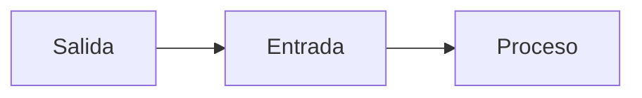
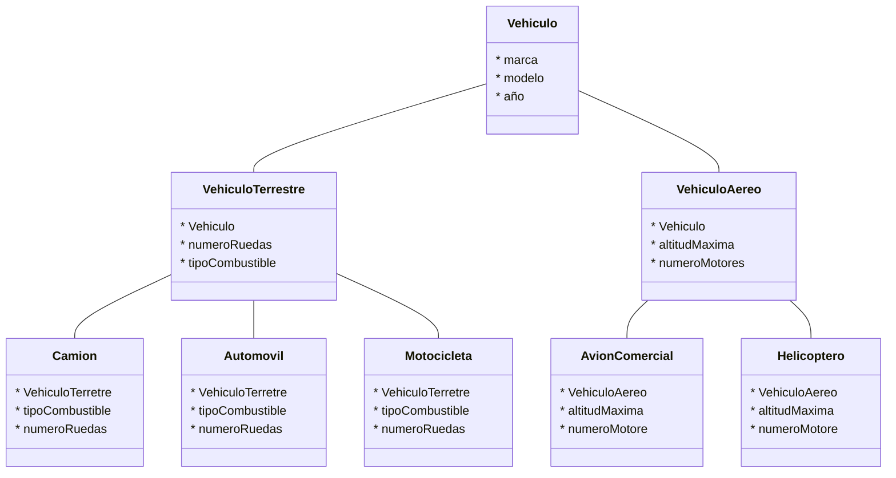
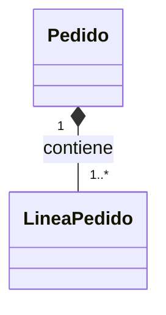

# Martes 17 de Marzo 

## La Naturaleza Compleja del Software
---

### El Problema: Crecimiento y Caos
- Los sistremas informaticos crecen innevitablemente en tama;o y funcionalidad

### El Antídoto: Ingeniería y Diseño
- Modularidad
- Modelado
- Arquitectura


### Abstracción: El filtro del arquitecto
1. Entidad del Mundo real
2. Proceso de Absstracción
3. Representación Computacional


---

## Anatomía Estructural: Clase vs. Objetos

### La Clase (El Molde)
- Plantilla abstracta que define el conjunto de atributos y comportamientos

### El Objeto (La instancia)
- Representacion computacional de una cosa o evento real

---

## UML: El Lenguaje Universal de Modelado

### Estandarizacion
El estandar de la industria para visualizar, especificar y documentar software.

### Perspectiva Estructural
Modelos estaticos que muestran como se organizan los objetos.

### Perpectiva de Comportamiento
Modelos dinamicos que muestran como colaboran los objetos en el tiempo.





¡Excelente elección de tema! En el Análisis y Diseño Orientado a Objetos (ADOO), la jerarquía de vehículos es el ejemplo clásico para entender cómo la **abstracción** y la **herencia** nos permiten reutilizar código y organizar la lógica del mundo real.

Para que este diseño sea robusto, debemos identificar los atributos comunes en la "clase padre" y dejar los detalles específicos para las "clases hijas".

---

# Actividad Ejercicios de Arquitectura

## Jerarquia de herencia para distintos tipos de vehiculos

### Clase Principal
```bash
Vechiculo(marca, modelo, anio)
```

### Clases de Categorizacion
```bash
VehiculoTerrestre(superVehiculo, numeroRuedas, tipoCombustible)

VehiculoAereo(superVehiculo, altitudMaxima, numeroMotores)
```

| Clase Padre | Clases Hijas  | Atributos Específicos |
| :--- | :--- | :--- |
| **VehiculoTerrestre** | `Automovil`, `Motocicleta`, `Camion` | `numeroPuertas`, `cilindrada`, `capacidadCarga` |
| **VehiculoAereo** | `AvionComercial`, `Helicoptero` | `capacidadPasajeros`, `numeroRotores` |



---

## Identifique relaciones de composición en un sistema de pedidos en línea.

### Clase Principal
```bash
Order()
```

### Clase Hija
```bash
OrderItem()
```

### Lógica de la relación (composición)
Un pedido (Order) se compone de una o varias lineas de pedidos/productos.

Si se elimina un pedido antes de efectuarlo/procesarlo (Order), las líneas de Pedido (OrderItem) debe de eliminarse con el, pues no pueden quedar los datos de los detalles del pedido en un pedido que fue eliminado antes de efectuarse



---

## Identifique objetos en un sistema de gestión de biblioteca digital.


### Identificacion de Grupos de clases

1. **Objetos de Recursos**
    - Libro
    - Revistas
    - Autores
    - Categorias

2. **Objetos de Usuarios**
    - Admins
    - Bibliotecarios
    - UsuariosLectores

3. **Objetos de Procesos**
    - Reservas
    - Prestamos

### Tabla de Objetos: Sistema de Gestión de Biblioteca Digital

| Objetos | Recursos | Usuarios | Procesos |
| :--- | :--- | :--- | :--- |
| 1 | *Libro* | *Admins* |*Reservas* |
| 2 | *Revista* | *Bibliotecarios* | *Prestamos* |
| 3 | *Autor* | *UsuariosLectores* |  |
| 4 | *Categoría* |  | |


